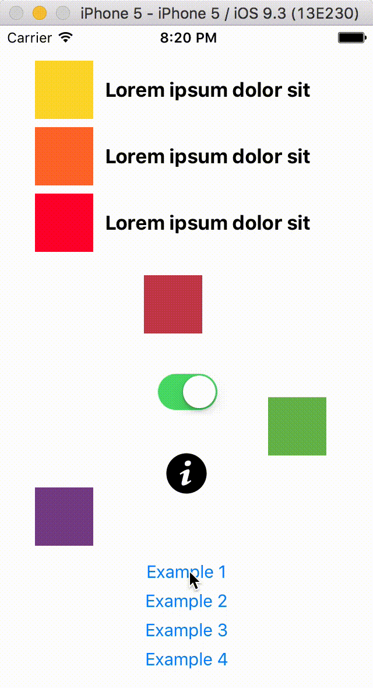
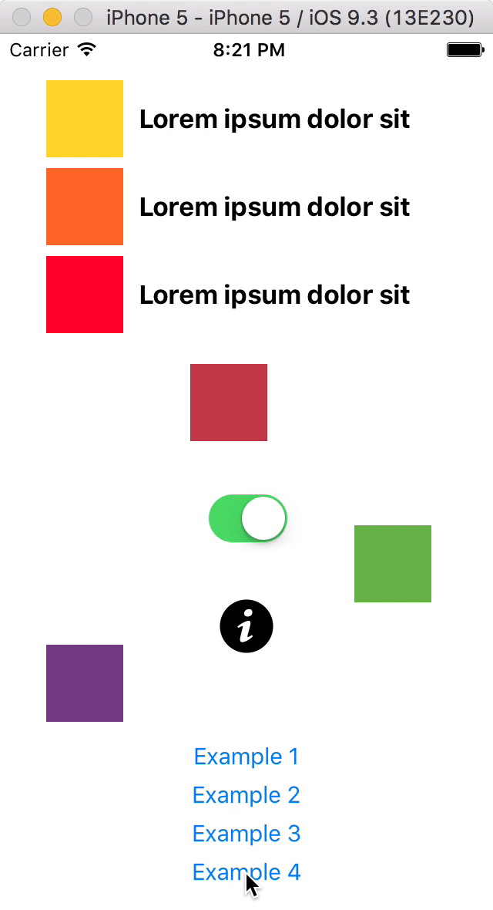

    
    </a>
    
    

# ALAnimatable

**ALAnimatable** adds an `Animatable` protocol into your project that lets you animate all subviews in a view at once with just a single line of code, providing you have created your user interface using Auto Layout.

## Compatibility

**ALAnimatable** requires iOS 8+ and is compatible with Swift 2 projects using Auto Layout.

## Installation

### CocoaPods

Installation for [CocoaPods](https://cocoapods.org) is simple enough:

    use_frameworks!
    pod 'ALAnimatable'

And `import ALAnimatable` in the files you would like to use it.

### Old school

Just drag the file `Animatable.swift` into your project. That is all you really need.

## Usage

The full signature for the `animateSubviews` method includes more options appart from the mandatory `direction`:

    func animateSubviews(from direction: AnimatableDirection, destination: AnimatableDestination, speed: AnimatableSpeed,
                              origin: AnimatableOrigin, bouncing: Bool, excluding: Set<UIView>) 

* `destination: AnimatableDestination` can be `In` (default option) or `Out` and indicates whether all subviews are supposed to animate to enter into the view or to go away.
* `speed: AnimatableSpeed` can be `Quick`, `Medium` (default option) or `Slow` and sets the duration for the animation.
* `origin: AnimatableOrigin` can be `Close` (default option), `Far` or `ReallyFar` and indicates how far the views are placed at the beginning of the animation (or how far they will go if it's an `Out` animation). This impacts a bit, but not much, on the subviews movement.
* `bouncing: Bool` can obviously be `true` (default option) or `false` and sets whether or not the subviews will bounce at the end of the animation.
* `excluding: Set<UIView>` expects a set (so you can pass an array) with all your view's subviews that you **do not** want to be animated. Its default value is an empty set, so all subviews get animated.

### So, how does this work?

1. First of all, you need to create your user interface using Auto Layout (the AL prefix in `ALAnimatable` is actually for Auto Layout, not for Albert). You do not need to set any special constraint or priority or whatever. Just forget you are going to animate the views and design your interface as you would normally do.

2. Secondly, in your code you call that single line of code on the main view that contains all the rest. It may very well be the main `UIViewController`'s `view`.

3. Nothing else.

From the source code point of view, `ALAnimatable` creates an `Animatable` protocol and adds an extension with all its functionality that can only be adopted by `UIView`. It also sets another extension to say that `UIView` actually adopts `Animatable`. If you do not want every single `UIView` in your project to adopt `Animatable`, you can remove the `extension UIView: Animatable { }` line and then ensure a `UIView` subclass of yours adopts the protocol.

### What NSLayoutAttribute options can be used so they get animated?

All options that make sense for horizontal or vertical constraints. That is `CenterX`, `CenterXWithinMargins`, `Leading`, `LeadingMargin`, `Left`, `LeftMargin`, `Right`, `RightMargin`, `Trailing` and `TrailingMargin` for horizontal animations and `Bottom`, `BottomMargin`, `CenterY`, `CenterYWithinMargins`, `Top` and `TopMargin` for vertical animations.

### Does it work well with views inside views inside views... or views inside stack views inside stack views inside...?

Yes, it does. And good luck cleaning all those warnings in Interface Builder if you are using nested stack views.

## Some examples

### Example 1

To animate all subviews in main `UIViewController`'s `view` (except the buttons at the bottom) coming from the right:

    view.animateSubviews(from: .Right, excluding: [buttons])

### Example 2

To animate all subviews in main `UIViewController`'s `view` (except the buttons at the bottom) coming from the left and moving out of the screen slowly but going far:

    view.animateSubviews(from: .Left, destination: .Out, speed: .Slow, origin: .Far, excluding: [buttons])

### Example 3

To animate all subviews in main `UIViewController`'s `view` (except the buttons at the bottom) coming from the top and really far (so they will appear abruptly):

    view.animateSubviews(from: .Top, origin: .ReallyFar, excluding: [buttons])

### Example 4

To animate all subviews in main `UIViewController`'s `view` (except the buttons at the bottom) coming from the bottom and without final bouncing:

    view.animateSubviews(from: .Bottom, bouncing: false, excluding: [buttons])

## Some considerations to keep in mind:

* As expected, the Auto Layout system needs to be valid for `ALAnimatable` to work reliably. 

* The `excluding` parameter lets you set some subviews you do not want to be animated as long as they are placed using constraints involving the main view or other subviews that are also excluded from the animation process. If you pass a subview in `excluding` but its position in the screen is set by constraints involving other subviews that are going to be animated, your subview will be as well.

## Author

Albert Mata

## License

`ALAnimatable` uses the MIT license. Please file an issue if you have any questions or if you would like to share how you are using this tool.
